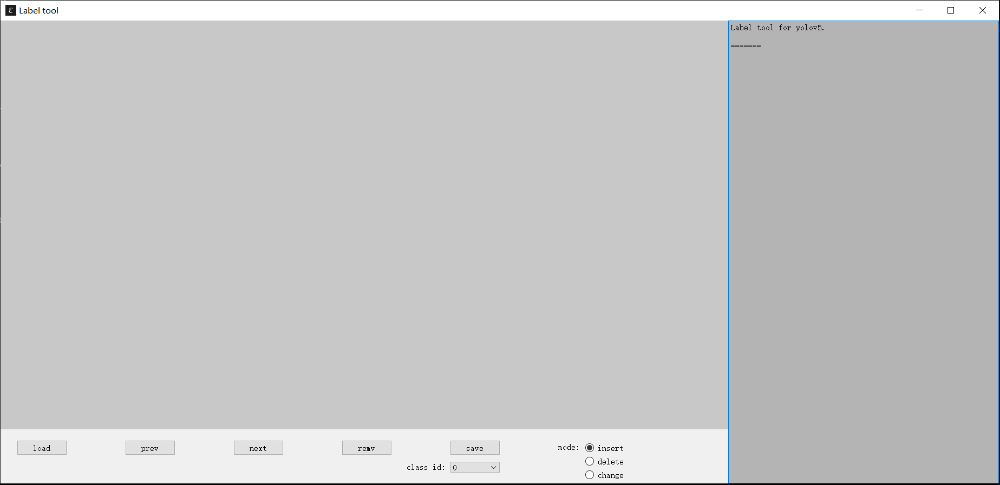
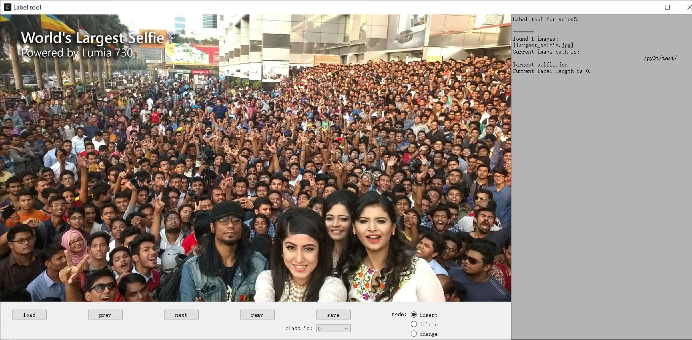

# AutoLabel for YOLO

这是一个用PyQt5制作的数据集标注工具，主要功能：  

- 生成yolov5训练格式的标签
- 将视频转换为图片序列
- 使用预训练的模型对图片进行预标注


1. 界面示例

<center>

</center>


<center>

</center>

## 2. 按钮以及快捷键：

### 2.1. 按钮

<center>
<table style="width:70%;text-align:center">
  <tr>
    <th colspan="" width=50% style="text-align:center">按钮名称</th>
    <th style="text-align:center">功能</th>
  </tr>
  <tr>
    <td>vcvt</td>
    <td>将视频转换为图片序列</td>
  </tr>
  <tr>
    <td>load</td>
    <td>加载图片序列</td>
  </tr>
  <tr>
    <td>prev</td>
    <td>前一张图片</td>
  </tr>
  <tr>
    <td>next</td>
    <td>后一张图片</td>
  </tr>
  <tr>
    <td>remv</td>
    <td>删除最后一个添加的边界框</td>
  </tr>
  <tr>
    <td>save</td>
    <td>保存当前图片的标签</td>
  </tr>
</table>
</center>

### 2.2. 快捷键

<center>
<table style="width:70%;text-align:center">
  <tr>
    <th colspan="" width=50% style="text-align:center">按钮名称</th>
    <th style="text-align:center">功能</th>
  </tr>
  <tr>
    <td>i</td>
    <td>插入模式</td>
  </tr>
  <tr>
    <td>d</td>
    <td>删除模式</td>
  </tr>
  <tr>
    <td>c</td>
    <td>修改模式，点击边界框可以将标签替换为当前所选值</td>
  </tr>
  <tr>
    <td>退格</td>
    <td>快速删除上一个添加的边界框</td>
  </tr>
  <tr>
    <td>数字键</td>
    <td>切换当前标签</td>
  </tr>
  <tr>
    <td>左右方向键</td>
    <td>前一张，后一张</td>
  </tr>
  <tr>
    <td>回车</td>
    <td>保存</td>
  </tr>
</table>
</center>


## 3. 使用方法：
### 3.1. 启动
```
# 安装依赖
pip install -r requirement.txt

# 启动界面
python AutoLabel.py
```

### 3.2. 视频切分

点击vcvt按钮，选择视频文件，默认每隔25帧截取一帧  
完成后，图片序列的保存路径会在右侧提示

### 3.3. 图像标注

点击load按钮，选择图像序列的目录，成功加载后，显示第一张图片

切换为insert模式（快捷键为i），在下拉菜单中选择标签，随后使用鼠标画框进行标注

完成该帧全部标注之后，点击save按钮（快捷键enter）进行保存

图片'./images/file_name.jpg'对应的标签将存放至'./lables/file_name.txt'

使用方向键左右进行前后帧的切换
